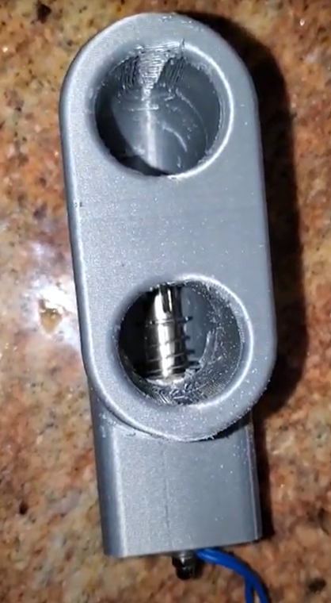
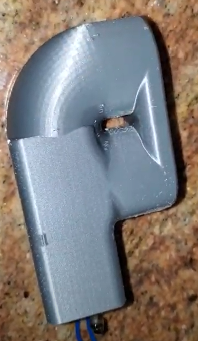

# Project #52: patient-inflating-valve
3D printed patient inflating valve

# License
This uses the [CERN Open Hardware Strong Reciprocity License](https://ohwr.org/cern_ohl_s_v2.pdf).

# Description
We have designed a low cost patient inflating valve using simple 3D printed parts, a thin sheet of polypropylene, a $12 electric solenoid actuator and a microcontroller. With some modification and customization, the valve could be deployed in circumstances where spontaneous breathing is desired but not supported by the available ventilation technology. With two standard 22 millimeter ports, the device is compatible with many ventilator designs. Its simple design and construction make it easy highly adaptable.
# *Images

Figure 1: valve front view

Figure 1: valve side view

# Motivation
In an immediate response to the global ventilator shortage percipitated by the COVID-19 crisis, thousands of engineers and medical professionals organized independently to design and globally distribute low-cost "pandemic ventilators" [2]. While few such devices have successfully been deployed in hospitals and medical environments, the mobilization and momentum of the "maker" community around this problem helped prove and promote the cause of distributed, open-source efforts to 
address critically emergent global challenges. 

Modularity is a key element of this approach: groups endeavouring to solve problems like the 2020 ventilator shortage can focus on producing supply-chain resilitent stand-alone
modules rather than the complete ventilator, reducing the engineering burden on each group. By working in communication with other teams, groups of teams can produce all the
functional modules of a ventilator or other compound medical device, seek approval and manufacturing support and reduce the time it takes to get devices into clinicians' hands.
Most importantly, clinicians can then be more able to replace damaged or difficult-to-obtain modules of compound devices with approved modular substitutes, enhancing rapid 
response in clinical settings, where the exact replacements may often be subject to distribution delays and import/export restrictions during times of crisis. This was certainly
the case during the Covid crisis, wherein ventilator development teams managed to produce basic viable prototypes but struggled to support secondary functions like oxygen mixing
and support for spontaneous breathing which can be managed by detachable, self-contained modules. To explicate this modular approach, we have designed and fabricated a 
self-contained modular "Patient Inflating Valve" with standard 22 mm ports, designed to be compatible with many traditional ventilator models.

Any device claiming to be able to provide safe, reliable and effective invasive and non-invasive mechanical ventilation to patients should provide a multitude of features, 
many of which have been set forth by relevant regulatory agencies. One such criteria, which is not always well-addressed is the need to support spontaneous breathing. While 
some of such ventilators have been designed to include special consideration for the support of patient spontaneous breathing, often by the inclusion of controlled mechanical 
valves, many prominent commercial and open-source ventilaors fail to explicitly support spontaneous breathing in their designs [2][4]. The inclusion of a patient inflating 
valve, defined as a one-way valve that closes to enable lung inflation and opens to allow exhalation and spontaneous breathing [1], is one way a mechanical ventilator 
can achieved endeavour to support spontaneous breathing. 

*"Patient inflating valves combined with self-inflating bags are known to all anaesthetists as resuscitation devices and are familiar as components of draw-over anaesthesia systems. Their variants are also commonplace in transfer and home ventilators. However, the many variations in structure and function have led to difficulties in their optimal use, definition and classification"* - [5]

**Video demonstrating functionality *https://photos.app.goo.gl/HCpLDrxADaKFfpps9

Conclusion and Future Work:
While we sought to optimize design simplicity and fabrication costs as primary design constraints in this iteration, there are of course many factors to consider in designing 
such valves. Sealing in the valve is sub-optimal and can be adjusted to suit respiratory pressures in future iterations. There is a wealth of research on sealing 3D printed
mechanical valves that can be sought for this purpose. This is of-course a binary valve, not featuring proportional or servo control. Valve designs featuring such versatility
certainly have their place in ventilator design but are not strictly necessary for supporting spontaneous breathing. Again, such features can be adapted by modulating the design
to suit actuation by a servo or other non-binary actuator.

[1] - https://journals.sagepub.com/doi/pdf/10.1177/0310057X1304100206
[2] - https://docs.google.com/spreadsheets/d/1inYw5H4RiL0AC_J9vPWzJxXCdlkMLPBRdPgEVKF8DZw/edit#gid=0
[3] - https://www.pubinv.org/mission/
[4] - https://www.ncbi.nlm.nih.gov/pmc/articles/PMC7195895/
[5] - https://pubmed.ncbi.nlm.nih.gov/23530783/
